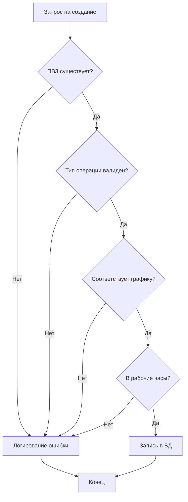

# User Stories

## Роли в системе
| Роль | Описание |
|------|----------|
| Оператор ПВЗ | Сотрудник конкретного пункта выдачи. Регистрирует операции, следит за текущей загрузкой своей точки. |
| Супервайзер региона | Менеджер, ответственный за группу ПВЗ в регионе. Контролирует показатели и распределение нагрузки. |
| Операционный аналитик | Специалист по данным. Анализирует эффективность всей сети, выгружает отчеты, отслеживает ошибки. |

## Оператор ПВЗ
| ID | User Story | Приоритет |
|----|-----------|-----------|
| US-01 | Как оператор ПВЗ, я хочу авторизоваться в системе под своей учетной записью, чтобы получить доступ к функциям управления моей точкой | Must |
| US-02 | Как оператор ПВЗ, я хочу видеть информацию о своем ПВЗ и график его работы, чтобы сверяться с установленным режимом | Must |
| US-03 | Как оператор ПВЗ, я хочу регистрировать операции приема (in), выдачи (out) и возврата (return) товаров, чтобы фиксировать товарооборот | Must |
| US-04 | Как оператор ПВЗ, я хочу видеть список последних операций на моей точке, чтобы контролировать корректность ввода данных | Must |
| US-05 | Как оператор ПВЗ, я хочу видеть отчет по загрузке моей точки по часам, чтобы понимать пиковые интервалы и планировать перерывы | Should |
| US-06 | Как оператор ПВЗ, я хочу видеть тепловую карту загрузки моей точки по дням недели, чтобы знать, в какие дни ожидать наибольший поток клиентов | Could |

## Супервайзер региона
| ID | User Story | Приоритет |
|----|-----------|-----------|
| US-07 | Как супервайзер региона, я хочу видеть список всех ПВЗ в моем регионе, чтобы иметь быстрый доступ к их данным | Must |
| US-08 | Как супервайзер региона, я хочу просматривать историю операций по всем ПВЗ моего региона с фильтрацией по типу и дате, чтобы отслеживать активность | Must |
| US-09 | Как супервайзер региона, я хочу видеть сводный отчет по загрузке ПВЗ региона с индикацией перегруженных точек, чтобы оперативно реагировать на проблемы | Must |
| US-10 | Как супервайзер региона, я хочу видеть тепловую карту для любого ПВЗ в моем регионе, чтобы анализировать паттерны нагрузки | Should |
| US-11 | Как супервайзер региона, я хочу просматривать лог ошибок валидации операций, чтобы выявлять нарушения регламента работы (например, операции вне рабочих часов) | Should |

## Операционный аналитик
| ID | User Story | Приоритет |
|----|-----------|-----------|
| US-12 | Как операционный аналитик, я хочу иметь доступ к данным всех ПВЗ и всех операций в системе без региональных ограничений, чтобы проводить полный аудит | Must |
| US-13 | Как операционный аналитик, я хочу видеть ключевые KPI (средняя загрузка, доля перегруженных интервалов) в отчетах, чтобы оценивать эффективность сети | Must |
| US-14 | Как операционный аналитик, я хочу экспортировать данные о загрузке ПВЗ в формате CSV, чтобы проводить глубокий анализ в сторонних инструментах | Must |
| US-15 | Как операционный аналитик, я хочу создавать новые записи об операциях для любого ПВЗ (например, при массовой загрузке данных), чтобы корректировать статистику | Could |

## Диаграмма состояний / процессов

В системе отсутствует сложный жизненный цикл заказа, однако реализован процесс валидации операции при её создании.

### Процесс регистрации операции

**Правила переходов и валидации:**
1. **Существование:** Операция может быть создана только для существующего `pvz_id`.
2. **Тип:** Допустимые типы операций: `in` (прием), `out` (выдача), `return` (возврат).
3. **График:** Операция отклоняется, если для ПВЗ не задано расписание на текущий день недели.
4. **Время:** Операция отклоняется, если время её совершения (`ts`) выходит за рамки `open_time` и `close_time` из расписания.
5. **Ошибки:** Все отклоненные операции автоматически записываются в таблицу `error_log` с указанием причины отказа.

## MoSCoW
| Приоритет | Описание |
|-----------|----------|
| Must | Критически важный функционал: авторизация, CRUD операций, базовые отчеты по загрузке, фильтрация по ролям. |
| Should | Важный, но не блокирующий функционал: тепловые карты, просмотр лога ошибок, детальные KPI. |
| Could | Дополнительные возможности: экспорт в CSV (реализован), создание операций аналитиком. |
| Won't | Не реализовано: уведомления о перегрузке в реальном времени, прогнозирование нагрузки на основе ИИ. |
