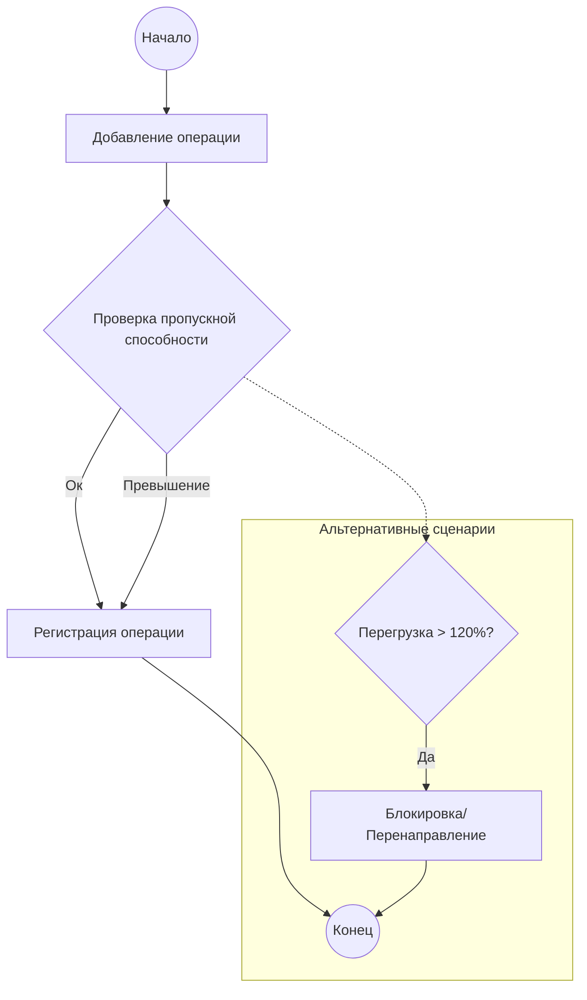

# BPMN-диаграмма (текстовое описание)

## Участники процесса
- Оператор ПВЗ
- Супервайзер региона
- Операционный аналитик

## Последовательность шагов
1. Добавление операции → 2. Проверка пропускной способности → 3. Регистрация операции

## Альтернативные потоки
- Если пропускная способность превышена, операция регистрируется, но помечается как перегрузка в отчетах.

## Альтернативные сценарии
- Отмена операции при критической перегрузке
- Перенаправление операций на соседний ПВЗ
- Автоматическая блокировка новых операций при перегрузке >120%