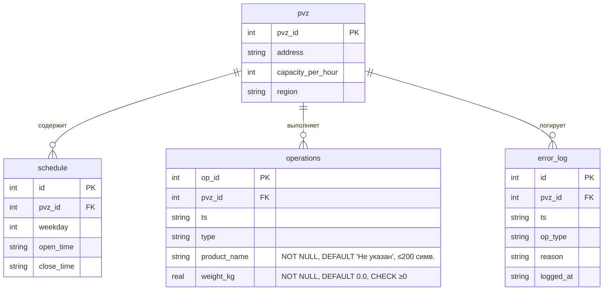

# DOC-DES-001 — ER-диаграмма (модель данных)

| Версия | Статус | Дата создания | Дата обновления |
|--------|--------|---------------|-----------------|
| v1.2   | Draft  | 2026-05-05    | 2026-05-30      |

О документе: ER-диаграмма и описание сущностей системы PVZ Monitor.

Для кого: backend-разработчики, аналитик, тестировщик.

Основано на: [кейсе проекта](../../SRS.md), [user stories](../02-requirements/user_stories.md).

---

## Авторы документа

- Безручко Александр Вадимович — Backend Developer — проектирование модели
- Рахимов Р.С. — Team Lead — архитектурный контроль

## История изменений

- [v1.0] [2026-05-05] (Безручко): первичная ER-диаграмма.
- [v1.1] [2026-05-10] (Безручко, Юркив): добавлена таблица `error_log`, уточнены связи.
- [v1.2] [2026-05-30] (Безручко, Рахимов): добавлены атрибуты `product_name`, `weight_kg` к сущности «Операция».

---

## Сущности и атрибуты

- **pvz** (pvz_id, address, capacity_per_hour, region)
- **schedule** (id, pvz_id, weekday, open_time, close_time)
- **operations** (op_id, pvz_id, ts, type, product_name, weight_kg)
- **error_log** (id, pvz_id, ts, op_type, reason, logged_at)

## Связи

- 1:N между pvz и schedule по полю pvz_id.
- 1:N между pvz и operations по полю pvz_id.
- 1:N между pvz и error_log по полю pvz_id (логическая связь).

## Mermaid-схема

---

## Описание атрибутов сущности «Операция»

| Атрибут         | Тип    | Ограничения                              | Описание                           |
|-----------------|--------|------------------------------------------|------------------------------------|
| `op_id`         | int    | PK                                       | Идентификатор операции             |
| `pvz_id`        | int    | FK → pvz                                 | Ссылка на ПВЗ                      |
| `ts`            | string | NOT NULL, ISO 8601                       | Метка времени операции             |
| `type`          | string | NOT NULL, ∈ {in, out, return}            | Тип операции                       |
| `product_name`  | string | NOT NULL, DEFAULT 'Не указан', ≤200 симв.| Наименование товара                |
| `weight_kg`     | real   | NOT NULL, DEFAULT 0.0, CHECK ≥0          | Вес товара в килограммах           |

> **Ответственный за обновление:** Безручко А.В. (Backend Developer) + Рахимов Р.С. (Team Lead)
